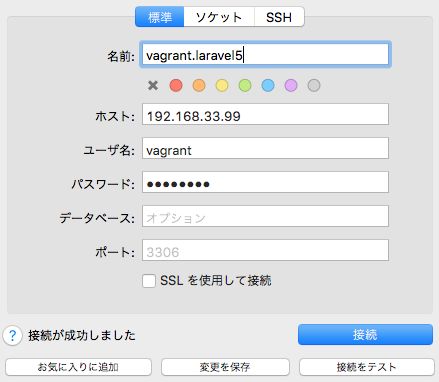

# Vagrant Laravel5

CentOS7でLaravel5が動作する環境を構築します。

# 環境構築

```
$ git clone https://github.com/ucan-lab/vagrant-laravel5
$ cd vagrant-laravel5
$ cp Vagrantfile.example Vagrantfile
$ vagrant up
```

# 設定値

項目 | 値
--- | ---
IP | 192.168.33.99
ドキュメントルート | /var/www/html
URL | http://192.168.33.99
マウント場所 | ./ <=> /var/www/html
MySQLユーザー | vagrant
MySQLパスワード | P@ssw0rd

# バージョン

項目 | 値
--- | ---
CentOS | 7.x
PHP | 7.2.x
Composer | 1.x
MySQL | 8.0.x
Apache | 2.x
Node(npm) | 8.x(5.x)
yarn | 1.x
Git | 2.x
heroku-cli | 6.99.0

# Sequel Pro 接続設定



# リンク

- [Vagrant&VirtualBoxインストール手順](https://github.com/ucan-lab/vagrant-laravel5/wiki/mac-vagrant-virtualbox-install)
- [Laravel5.5をインストールする例](https://github.com/ucan-lab/vagrant-laravel5/wiki/laravel5.5-install-example)
- [Laravelプロジェクトをgit cloneする例](https://github.com/ucan-lab/vagrant-laravel5/wiki/laravel-project-git-clone-example)
- [エイリアス設定](https://github.com/ucan-lab/vagrant-laravel5/blob/master/provision/project/.bash_aliases)
- [MySQL8.0 caching_sha2_password エラー対策](https://github.com/ucan-lab/vagrant-laravel5/issues/4)
- [MySQL8.0 NO_AUTO_CREATE_USERのSQL_MODE エラー対策](https://github.com/ucan-lab/vagrant-laravel5/issues/5)
